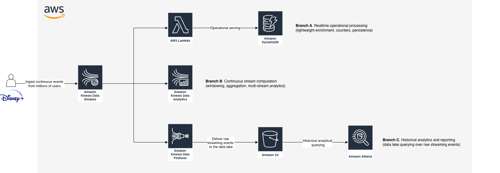
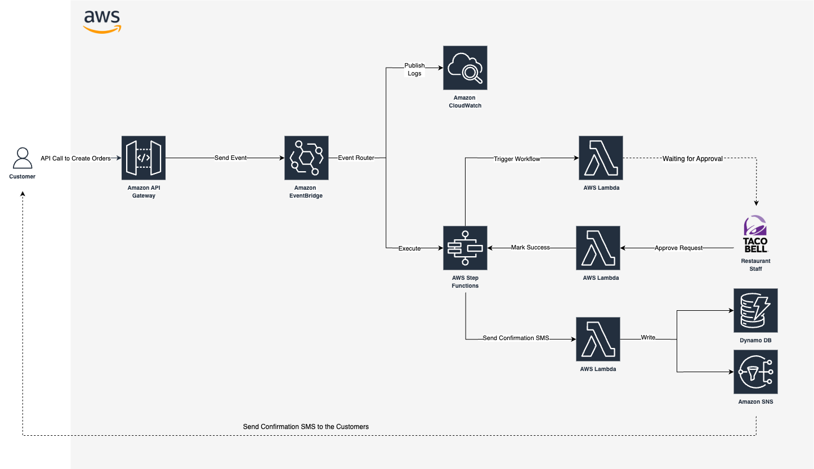

# Serverless Data Processing in AWS
EDEM 2026

- Professor: [Javi Briones](https://github.com/jabrio)

## Real-Time Streaming Architecture

#### Case description


Disney+ is looking to analyze real-time user engagement across its streaming platform. The company wants to track how users interact with movies: when they play, pause, or finish content.

Using a serverless streaming architecture, Disney+ aims to identify the most popular titles and viewing behaviors in real time. These insights help improve content recommendations and overall user experience.

Different types of event consumers coexist within the platform:

1. Some events require immediate lightweight processing (e.g. counters, enrichment, operational persistence).

2. Continuous stream processing and aggregation are required across multiple event streams to compute real-time metrics and engagement analytics.

3. Raw streaming events must also be stored in the company data lake for historical analytics and reporting.

#### Data Architecture
   

## Setup Requirements

- For this demo, you can use either your local environment or the AWS CloudShell available in the AWS Console.

- Clone this repository in your selected environment.

- To avoid unexpected charges caused by resources outside the scope of this exercise, we will create a dedicated IAM user with access only to the services required for this lab.

    - a. Create an IAM Group:

        - Open the IAM Console.
        - In the left-hand menu, click **User groups**.
        - Click **Create group**.
        - Provide a group name.
    
    - b. Create the IAM Policy

        - Create a new IAM Policy with the following permissions:

        ```json
        {
            "Version": "2012-10-17",
            "Statement": [
                {
                "Sid": "AllowEdemServices",
                "Effect": "Allow",
                "Action": [
                    "sqs:*",
                    "sns:*",
                    "kinesis:*",
                    "firehose:*",
                    "kinesisanalytics:*",
                    "kinesisanalyticsv2:*",
                    "dynamodb:*",
                    "s3:*",
                    "lambda:*",
                    "athena:*",
                    "states:*",
                    "events:*",
                    "apigateway:*",
                    "logs:*",
                    "cloudwatch:*",
                    "glue:*",

                    "iam:ListPolicies",
                    "iam:GetPolicy",
                    "iam:GetPolicyVersion",
                    "iam:AttachGroupPolicy",

                    "iam:CreateGroup",
                    "iam:ListGroups",
                    "iam:AddUserToGroup",

                    "iam:CreateUser",
                    "iam:CreateLoginProfile",

                    "iam:GetRole",
                    "iam:ListRoles"
                ],
                "Resource": "*"
                },
                {
                "Sid": "AllowManageOnlyEdemRoles",
                "Effect": "Allow",
                "Action": [
                    "iam:CreateRole",
                    "iam:DeleteRole",
                    "iam:AttachRolePolicy",
                    "iam:DetachRolePolicy",
                    "iam:PutRolePolicy",
                    "iam:DeleteRolePolicy",
                    "iam:ListRolePolicies",
                    "iam:ListAttachedRolePolicies",
                    "iam:UpdateAssumeRolePolicy"
                ],
                "Resource": "arn:aws:iam::*:role/edem-*"
                },
                {
                "Sid": "AllowPassOnlyEdemPrefixedRoles",
                "Effect": "Allow",
                "Action": "iam:PassRole",
                "Resource": "arn:aws:iam::*:role/edem-*",
                "Condition": {
                    "StringEquals": {
                    "iam:PassedToService": [
                        "lambda.amazonaws.com",
                        "states.amazonaws.com",
                        "kinesisanalytics.amazonaws.com",
                        "firehose.amazonaws.com",
                        "apigateway.amazonaws.com",
                        "events.amazonaws.com"
                    ]
                    }
                }
                },
                {
                "Sid": "AllowManageOwnAccessKeys",
                "Effect": "Allow",
                "Action": [
                    "iam:CreateAccessKey",
                    "iam:DeleteAccessKey",
                    "iam:UpdateAccessKey",
                    "iam:ListAccessKeys"
                ],
                "Resource": "arn:aws:iam::*:user/${aws:username}"
                },
                {
                "Sid": "RestrictRegion",
                "Effect": "Deny",
                "NotAction": [
                    "iam:*",
                    "route53:*",
                    "cloudfront:*"
                ],
                "Resource": "*",
                "Condition": {
                    "StringNotEquals": {
                    "aws:RequestedRegion": "eu-north-1"
                    }
                }
                }
            ]
        }
        ```

        > **_IMPORTANT_NOTE:_**  All IAM roles created during this lab must start with **edem-**.
    
    - c. Attach the Policy to the Group

        - Open the previously created IAM Group.
        - Click **Add permissions**.
        - Attach the policy created in the previous step.

    - d. Create the IAM User

        - Open the IAM Console.
        - Click **Users** → **Create user**.
        - Provide a username.
        - Enable:

        ```text
        Provide user access to the AWS Management Console
        ```

        - Click **Next**.
        - Assign the user to the previously created group.
        - Click **Create user**.

    - e. Log In Using the New User

        Use the newly created IAM user for all exercises in this repository instead of the root user or an admin account.

        This setup significantly reduces the risk of:
        - accidentally creating expensive infrastructure,
        - leaving resources running,
        - and deploying services outside the scope of the course.

- To isolate the dependencies required for this lab, we will create a Python virtual environment using Anaconda. Any Python version is supported.

- Once the environment is created, activate it:

```bash
conda activate <ENVIRONMENT_NAME>
```

- Install the required dependencies:

```bash
cd 01_Code
pip install -r requirements.txt
```

---

## Branch A: Kinesis Data Streams + Lambda

### Kinesis Data Streams

- Open the Kinesis Console.
- In the **Kinesis Data Streams** section, click **Create data stream**.
- Provide a name for the stream (e.g. `DisneyClickstream`).
- To keep costs under control, select **Provisioned** capacity mode and configure **1 shard**.
- Click **Create data stream**.

### DynamoDB

- Open the DynamoDB Console.
- In the left-hand menu, click **Tables** → **Create table**.
- Provide a table name (e.g. `DisneyClickstreamTable`).
- Configure the following keys:

```text
Partition key: user_id
Sort key: timestamp
```

- Click **Create table**.

### Lambda

#### IAM - Create Lambda Execution Role

- Open the IAM Console and navigate to **Roles**.
- Click **Create role**.
- Select **AWS Service** as the trusted entity.
- From the use case dropdown, select **Lambda**.
- Click **Next**.
- Attach the following policies:

```text
AmazonDynamoDBFullAccess
AWSLambdaKinesisExecutionRole
```

- Click **Next**.
- Provide a name for the role.
- Click **Create role**.

#### Create Lambda Function

- Open the Lambda Console.
- Click **Create function**.
- Provide a name for the function.
- Select **Python 3.13** as the runtime.
- Select the IAM Role created in the previous step. Choose it from the **Custom execution role** dropdown located under the **Additional settings** section.
- Click **Create function**.
- After the function is created, add a Kinesis trigger:
    - Select **Kinesis** as the trigger type.
    - Choose the stream created previously.
    - Click **Add**.

> If permissions are correctly configured, the trigger will be attached successfully.

#### Deploy Lambda Code

- Open the **Code** tab.
- Copy and paste the code located in:

```text
01_Code/DataStream/LambdaKinesisToDynamoDB.py
```

- Configure the following environment variable:

```bash
DYNAMO_DB_TABLE_NAME=<YOUR_DYNAMODB_TABLE>
```

### Final Step

Start the data generator. Incoming events should now be automatically processed and persisted into DynamoDB.

```bash
cd 01_Code
python DisneyDataGenerator.py
```
---

### Extra Exercise - Lambda Batch Processing

In the previous example, the Lambda function processed incoming events individually and stored them in DynamoDB.

As an additional exercise, we will now use Lambda batch processing capabilities to perform a simple real-time aggregation directly inside the function.

The objective is to count how many events belong to each movie within the batch of records received from Kinesis.

This exercise demonstrates how Lambda can:
- process multiple records in a single invocation,
- perform lightweight aggregations,
- and implement simple stream processing logic without requiring a dedicated streaming engine.

> Note: Unlike Apache Flink, Lambda does not maintain continuous state over time.  
> The aggregation only exists during the current Lambda execution.

Suggested implementation:
- Iterate through `event["Records"]`
- Decode each Kinesis message
- Extract the `item_id`
- Count occurrences per movie using a Python dictionary or `Counter`
- Log the aggregation results to CloudWatch

---

## Branch B: Kinesis Data Streams + Managed Apache Flink

In the previous example, we covered the simplest streaming processing pipeline possible.

However, real-world streaming architectures often require:
- aggregations,
- grouping operations,
- windowing,
- and continuous computations over incoming events.

To provide the AWS equivalent of the Google Cloud Dataflow pipelines covered in previous sessions, we introduce **Apache Flink** as the stream processing engine replacing Apache Beam. The streaming concepts previously learned remain exactly the same.

For this section, we will continue using the Kinesis Data Stream created earlier.

### Create the Managed Apache Flink Studio Notebook

- Open the **Managed Apache Flink** Console.
- In the **Get started** section, select **Studio notebooks**.
- Since we will use Apache Zeppelin for real-time data visualization and streaming SQL queries, click **Create Studio notebook**.
- Provide a notebook name.
- The required IAM role will be automatically created with the necessary permissions.
- Before creating the notebook, create an AWS Glue Database to store metadata for streaming sources and sinks.
- Click **Create database**.
- In the new window:
    - Click **Add database**.
    - Provide a database name.
    - Click **Create database**.
- Return to the notebook creation page and click **Create Studio notebook**.
- Once created, click **Run**.
- After the notebook starts, click **Open in Apache Zeppelin**.
- Create a new Zeppelin note.

### Streaming SQL

Once inside the notebook, paste the SQL cells provided in this repository to perform real-time stream transformations and windowed aggregations.

- a. Create Flink SQL Table

```sql
%flink.ssql

CREATE TABLE movie_events (
    `timestamp` STRING,
    user_id STRING,
    event_type STRING,
    item_id STRING,
    event_value STRING,
    event_time AS TO_TIMESTAMP(REPLACE(SUBSTRING(`timestamp`, 1, 19), 'T', ' ')),
    WATERMARK FOR event_time AS event_time - INTERVAL '5' SECOND
)
WITH (
    'connector' = 'kinesis',
    'stream' = 'DisneyClickstream',
    'aws.region' = 'eu-north-1',
    'scan.stream.initpos' = 'LATEST',
    'format' = 'json'
);
```

- b. Real-Time Streaming Query

```sql
%flink.ssql

SELECT
    event_time,
    user_id,
    event_type,
    item_id,
    event_value
FROM movie_events;
```

- c. Windowed Aggregation Query

```sql
%flink.ssql

SELECT
    window_start,
    window_end,
    item_id AS movie_id,
    COUNT(*) AS total_events
FROM TABLE(
    TUMBLE(
        TABLE movie_events,
        DESCRIPTOR(event_time),
        INTERVAL '15' SECOND
    )
)
GROUP BY
    window_start,
    window_end,
    item_id;
```
---
### Extra Exercise

Replicate the Spotify streaming scenario from previous sessions:
- create multiple event streams,
- combine them,
- and apply small transformations using Apache Zeppelin and Flink SQL.
---

## Branch C: Kinesis Firehose + S3 + Athena

As a final step, we will store streaming events inside a data lake for later analytical querying.

### Create an S3 Bucket

- Open the S3 Console.
- Click **Create bucket**.
- Provide a bucket name.
- Click **Create bucket**.

### Create Kinesis Data Firehose

- Return to the Kinesis Console.
- Click **Create Firehose stream**.
- Select:
    - **Amazon Kinesis Data Stream** as the source.
    - **Amazon S3** as the destination.
- Provide a Firehose stream name.
- Under source configuration, select the Kinesis stream created earlier.
- Under destination configuration, select the S3 bucket previously created.
- Click **Create Firehose stream**.

### Query Data with Athena

- Open the Athena Console.
- Run analytical SQL queries against the data stored in S3.
- Build queries that best explain the business behavior and streaming activity generated during the exercise.

## Event-Driven Architecture

#### Case description


<br>

Taco Bell aims to enhance its order processing efficiency and scalability by implementing an event-driven architecture. This approach enables real-time management of customer orders, improving operational responsiveness and overall customer satisfaction.

#### Data Architecture


### EventBridge

- Go to the **Amazon EventBridge** Console.
- In the left-hand menu, click on **Event Buses**.
- Each project comes with a default bus, but we'll create a new one. Click **Create event bus**.
- Provide a *name* for the new event bus.
- Click **Create**.
- Go back to the left-hand menu and click on **Rules**. We'll create one rule per branch of our architecture.
- Select **Advanced Builder** as builder mode.
- Click **Create rule**.
- Enter a *name* for the rule.
- Select the *event bus* you just created.
- Click **Next**.
- Under *Event pattern*, choose **Other**.
- In the Event pattern **code editor**, paste the following:

```
{
  "source": [{
    "prefix": ""
  }]
}
```

- Click **Next**.
- For the *target*, select **CloudWatch Logs**, and define the name of the log group to be created.
- Click **Next**.
- Review your configuration and click **Create rule**.
- We need to repeat the same procedure for the other branch of the architecture, where we'll create the required **Step Functions** resource. The pattern will be as follows:

```
{
  "source": [{
    "prefix": "com.tacobell.orders"
  }]
}
```

### SNS

- Go to the **Amazon SNS** Console.
- Click **Create topic**, and give it a *name*.
- Select **Standard** as the *topic type*.
- Click **Create topic**.
- Create a **subscription**. Choose **Email** or **SMS** as the protocol (depending on your preference).
- Provide the corresponding endpoint.
- Click **Create subscription**.

### Lambda

The event-driven workflow involves creating one Lambda function for each of the following components:

| Function Name      | Description                           | Required Permission           |
|--------------------|---------------------------------------|-------------------------------|
| LambdaHumanApproval     | Handles human validation              | `lambda:InvokeFunction`       |
| LambdaApprovalHandler   | Triggers Step Functions               | `states:StartExecution`       |
| LambdaToSNS      | Sends data to SNS and DynamoDB        | `sns:Publish`, DynamoDB write |

#### IAM: Create a Role for Lambda

- Open the **IAM Console** and go to the **Roles** section.
- Click **Create role**.
- Select **AWS Service** as the trusted entity type.
- From the *Use case* dropdown, choose **Lambda**.
- Click **Next**.
- Attach the following permissions policies:
    - AmazonSNSFullAccess
    - AWSStepFunctionsFullAccess
- Click **Next**.
- Provide a **name** for your role.
- Click **Create role**.

#### Lambda
- Go to the **AWS Lambda** Console.
- Click **Create function**.
- Enter a *name* for your function (e.g., LambdaHumanApproval, LambdaApprovalHandler, etc.).
- Select **Python 3.13** as the runtime.
- Click **Use an existing role** and choose the role you just created.
- Click **Create function**.
- For each function, navigate to the Code tab and paste the corresponding script from the `01_code/EventDriven/` folder in this repository.
- For the LambdaToSNS function, we’ll need to add this environment variable:

```
SNS_TOPIC_ARN = <YOUR_SNS_TOPIC_ARN>>
```

### Step Functions

- Open the **Step Functions** Console.
- Click **Create State machine**.
- *Name* your State Machine.
- Choose **Standard** as the type.
- Use the *Workflow Studio*.
- Go to the **Code** tab and paste the code provided in this file `/01_Code/EventDriven/StepFunctionsDefinition.json` of this repository.
- Click **Create**.

### API Gateway

#### IAM: Policies & Roles

- A. Policy

    - Go to the **IAM Console**.
    - In the left panel, click on **Policies**.
    - Click **Create policy**.
    - In the service dropdown, select **EventBridge**.
    - Go to the *write* dropdown and check **PutEvents**.
    - Resources: click **Add ARN** and paste the ARN of your Event Bus (created earlier).
    - *Name* your policy.
    - Click **Create policy**.

- B. Role

    - In the IAM console, go to **Roles**.
    - Click **Create role**.
    - Choose **AWS service** as Trusted entity type.
    - In the use case dropdown, select **API Gateway**.
    - Skip attaching policies for now, click **Next**.
    - *Name* your role.
    - Click **Create role**.
    - Once created, go to the role and click **Attach policies**.
    - Attach the policy you just created.

#### Rest API
- Go to the **API Gateway** Console.
- Under *REST API*, click **Build**.
- *Name* your API.
- Click **Create API**.
- Once created, click **Create Resource**.
- Enter Resource Name: `orders`.
- Click **Create Resource**.
- Click **Create Method**.
- From the dropdown, choose **POST**.
- In the POST method setup, select the following configuration:
    - Integration type: **AWS Service**.
    - AWS Region: <YOUR_REGION>
    - AWS Service: **CloudWatchEvents**.
    - HTTP Method: **POST**.
    - Action Type: **PutEvents**.
    - Execution Role: paste the **ARN of the IAM Role** you created earlier.
- Click **Create Method**.
- Click on **Integration Request**.
- Expand **Mapping Templates**.
- Under *Request body passthrough*, choose *When there are no templates defined (recommended)*.
- Click **Add mapping template**.
- Content-Type: application/json.
- In the template editor, paste this:

```
#set($context.requestOverride.header.X-Amz-Target = "AWSEvents.PutEvents")
#set($context.requestOverride.header.Content-Type = "application/x-amz-json-1.1")
{
  "Entries": [
    {
      "Source": "com.tacobell.orders",
      "DetailType": "OrderSubmitted",
      "Detail": "$util.escapeJavaScript($input.body)",
      "EventBusName": "YOUR_EVENT_BUS_NAME"
    }
  ]
}
```
- Click **Save**.
- Click **Deploy API**.
- Create a **new stage** named *dev*.
- Click **Deploy**.

### Final Step

Once the entire E2E setup is complete, you can use the generated endpoint to trigger events that simulate customer interactions with Taco Bell.

## Bibliography & Additional Resources

- Amazon SNS
    - https://docs.aws.amazon.com/sns/latest/dg
 
- Amazon Kinesis Data Streams
    - https://docs.aws.amazon.com/streams/latest/dev/introduction.html

- Amazon Managed Apache Flink (Kinesis Data Analytics)
    - https://docs.aws.amazon.com/managed-flink/latest/java/what-is.html

- Amazon Data Firehose
    - https://docs.aws.amazon.com/firehose/latest/dev/what-is-this-service.html

- Amazon DynamoDB
    - https://docs.aws.amazon.com/amazondynamodb/latest/developerguide/Introduction.html

- Amazon Athena
    - https://docs.aws.amazon.com/athena/latest/ug/what-is.html

- AWS Lambda 
    - https://docs.aws.amazon.com/lambda/latest/dg/welcome.html

- Amazon EventBridge
    - https://docs.aws.amazon.com/eventbridge/latest/userguide/eb-what-is.html

- Amazon StepFunctions
    - https://docs.aws.amazon.com/step-functions/latest/dg/welcome.html
